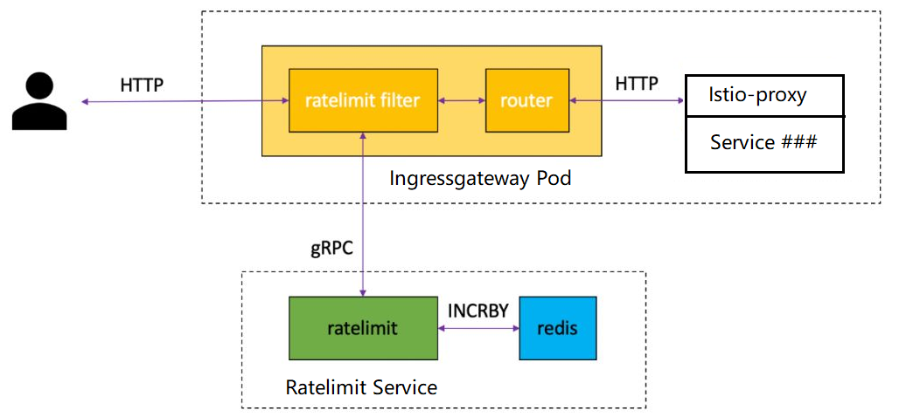

## Before you begin

1. Setup Istio in a Kubernetes cluster by following the instructions in the
   [Installation Guide](https://istio.io/latest/docs/setup/getting-started/).

1. Deploy the [Bookinfo](https://istio.io/latest//docs/examples/bookinfo/) sample application.


## Envoy RateLimit Architecture

Envoy can be used to [set up global rate limits](https://www.envoyproxy.io/docs/envoy/latest/intro/arch_overview/other_features/global_rate_limiting) for your mesh.
Global rate limiting in Envoy uses a gRPC API for requesting quota from a rate limiting service.
A [reference implementation](https://github.com/envoyproxy/ratelimit) of the API, written in Go with a Redis
backend, is used below.




## Quick Start
- Go through https://istio.io/latest/docs/tasks/policy-enforcement/rate-limit/

## Further Practice
- Go through https://github.com/johnzheng1975/istio-ratelimit-example

## Best Practice as HP OneCloud
- Apply `./code` here.
  ```
  $ kubectl apply -f ./code
  namespace/ratelimit created
  configmap/ratelimit-config created
  service/redis created
  deployment.apps/redis created
  service/ratelimit created
  deployment.apps/ratelimit created
  envoyfilter.networking.istio.io/filter-ratelimit created
  envoyfilter.networking.istio.io/filter-ratelimit-svc created
  envoyfilter.networking.istio.io/ef-ratelimit-pre-handle created
  ```
- Test result is expected. [below](https://github.com/johnzheng1975/istiocon2023/tree/main/samples/ratelimit#test-result)

### Requirements
We have below two requirements:

- Security Concern
  - For each client IP, limit the number of requests per minute.  
  - For some IP from known parnter cluster, we think it is securer, do not limit on this IP.
  - All projects need to apply this security purpose ratelimit.

- Business Concern
  - For tanent who has paid, for each api, limit the number of requests per minute to a high value. 
  - For tanent who has not paid, for each api, limit the number of requests per minute to a low value. 
  - Project owner can choose whether project api apply business purpose ratelimit or not.


### Challenges
- The logic is complex, if we implement with upper `Quick Start` or `Further Practice`

### Solutions
- We can use a pre-handler envoyfilter, handle the complex logic.
- Generate the additional request headers in the pre-handler envoyfilter.
- Ratelimit is based on these new generated request headers. 

### Design

- Security Purpose Ratelimit
  - Get client IP from request header `x-forwarded-for`.
  - Add this client IP as new request header `ratelimit-source-ip`.
  - Define a list of partner cluster IP, if client IP is in this list, do not limit, set new request header `ratelimit-enabled-secure` with value `false`. Otherwise, set `ratelimit-enabled-secure` with value `true`.
  - In ratelimit envoyfilter, based on `ratelimit-enabled-secure`, `ratelimit-source-ip`, configured as below
    ```
      - key: header_match
        value: oc-ratelimit-enabled-secure  # enable_ratelimit_secure
        descriptors:
          - key: CLIENTIP                   # ratelimit-source-ip
            rate_limit:
              unit: minute
              requests_per_unit: 12         # number here is for testing purpose

- Business Purpose Ratelimit
  - Get project name from request authority, add to new request header `ratelimit-project`.
  - Define a list of project which want to apply business purpose ratelimit, if project name is in this list, set new request header `ratelimit-enabled-business` with value "true". Otherwise, set `ratelimit-enabled-business` with value "false".
  - Get tenant_id from request token or request header, add to new request header `ratelimit-tenantid`.
  - Define a list of paid tanent, if tenant_id is in this list, set new request header `ratelimit-level` with value `premium`. Otherwise, set `ratelimit-level` with value `trail`.
  - In order to support ratelimit for path like "/user/acde070d-8c4c-4f0d-9d8a-162843c10333" (Get user details), covert path to "/user/{uuid}", and add to new request header `ratelimit-path`.
  - In ratelimit envoyfilter, based on `ratelimit-enabled-business`, `ratelimit-project`, `ratelimit-path`, `:method`, `ratelimit-tenantid`, `ratelimit-level`  configured as below

    ```
    descriptors:
      - key: header_match
        value: oc-ratelimit-enabled-business                 # ratelimit-enabled-business
        descriptors:
          - key: PROJECT                                     # ratelimit-project
            descriptors:
             - key: PATH                                     # ratelimit-path
               descriptors:
                 - key: METHOD                               # header :method
                   descriptors:
                     - key: TENANTID                         # ratelimit-tenantid
                       descriptors:
                         - key: TLEVEL                       # ratelimit-level
                           value: premium
                           rate_limit:
                             unit: minute
                             requests_per_unit: 8            # number here is for testing purpose
                         - key: TLEVEL
                           value: trial
                           rate_limit:
                             unit: minute
                             requests_per_unit: 4            # number here is for testing purpose

### Code
- Include below code:
  - 00-namespace-ratelimit.yaml               # For namespace creation
  - 10-configmap-ratelimit.yaml               # For configmap for ratelimit
  - 20-service-ratelimit-redis.yaml           # For ratelimit deploy creation, redis creation.
  - 30-envoyfilter-ratelimit.yaml             # For ratelimit envoyfilter
  - 40-envoyfilter-ratelimit-svc.yaml         # For ratelimit envoyfilter
  - 50-ef-ratelimit-pre-handle.yaml           # The pre-handler envoyfilter, make logic simple

- This code structure is simple, easy to maintain.
  -- 00, 10, 20, 30, 40 need not change.
  -- Only some variable in 50-ef-ratelimit-pre-handle.yaml need be changed， based on requirments change, as below:
  ```
    -- Define a list of partner cluster IP, if client IP is in this list, do not enable secure limit
    secure_platform_ips = { ["54.148.85.56"]=true, ["3.120.217.35"]=true, ["15.65.244.13"]=true, ["192.168.1.61"]=true }

    -- Assume only three projects enabled ratelimit, includes project1, project3, project5
    project_enabled_ratelimit = { ["project1"]=true, ["project3"]=true, ["project5"]=true }

    -- Assume tenant01 and tenant02 are premium tenant, the others are trial tenant
    premium_tenants = { ["tenant01"]=true, ["tenant03"]=true }
  ```

### Test Result
- Note: for below testing, you need care x-ratelimit-reset in http response, make sure run testing within one minute. Otherwise, it may inaccurate because of ratelimit reset.
- This is AWS example, you need set route53 record, create record, point "*.sample.sandbox-uw2.hponecloud.io" to "aadadf0fd85374ecca2d5256a064d3b7-1498085909.us-east-1.elb.amazonaws.com" before testing.

#### Test Scenario 01: Business ratelimit for premium tenants
```
# project1 is in projects enabled list, so busniness ratelimit is enabled.
# tenant01 is in premium_tenants list, so ratelimit value is 8.
$ for i in {1..9}; do curl -I "http://svc11-project1.sample.sandbox-uw2.hponecloud.io/productpage" -H "X-OneCloud-Tenant-ID: tenant01"; done;

# First 8 times, return 200
HTTP/1.1 200 OK
x-ratelimit-limit: 8, 8;w=60
x-ratelimit-remaining: 1
x-ratelimit-reset: 23


# For 9th time, return 429
HTTP/1.1 429 Too Many Requests
x-envoy-ratelimited: true
x-ratelimit-limit: 8, 8;w=60
x-ratelimit-remaining: 0
x-ratelimit-reset: 21

```
- Analyze
  - For project1, should enable business ratelimit;
  - For tenant01, it is premium level, so its limit value is 8.
  - Test result is correct.  

#### Test Scenario 02: Business ratelimit for trial tenants
```
# project1 is in projects enabled list, so busniness ratelimit is enabled.
# tenant02 is not in premium_tenants list, so ratelimit value is 4.
$ for i in {1..5}; do curl -I "http://svc11-project1.sample.sandbox-uw2.hponecloud.io/productpage" -H "X-OneCloud-Tenant-ID: tenant02"; done;

# First 4 times, return 200
HTTP/1.1 200 OK
x-ratelimit-limit: 4, 4;w=60
x-ratelimit-remaining: 0
x-ratelimit-reset: 17


# For 5th time, return 429
x-envoy-ratelimited: true
x-ratelimit-limit: 4, 4;w=60
x-ratelimit-remaining: 0
x-ratelimit-reset: 16
```
- Analyze
  - For project1, should enable business ratelimit;
  - For tenant02, it is trial level, so its limit value is 4.
  - Test result is correct.  
  
#### Test Scenario 03: Secure ratelimit only
```
# This client IP is not in partner cluster IP list. Secure ratelimit is enabled.
$ curl ifconfig.io
192.168.52.62

# project16 is not in projects enabled list, so busniness ratelimit is not enabled.
$ for i in {1..15}; do curl -I "http://svc2-project16.sample.sandbox-uw2.hponecloud.io/productpage" -H "X-OneCloud-Tenant-ID: tenant03"; done;

# First 12 times, return 200
HTTP/1.1 200 OK
x-ratelimit-limit: 12, 12;w=60
x-ratelimit-remaining: 1
x-ratelimit-reset: 34

# From 13th time, return 429
HTTP/1.1 429 Too Many Requests
x-envoy-ratelimited: true
x-ratelimit-limit: 12, 12;w=60
x-ratelimit-remaining: 0
x-ratelimit-reset: 32

```
- Analyze
  - For project16, should not enable business ratelimit;
  - For client ip `192.168.52.62`, it should enable secure ratelimit since it is not in partner ip list. The limit is 12 per minute.
  - 12 requests return 200, then return 429 from 13th request.
  - Test result is correct.  
  

#### Test Scenario 04: Both `Secure ratelimit` and `Business ratelimit` are disabled
```
# This client IP is in partner cluster IP list. Secure ratelimit is not enabled.
$ curl ifconfig.io
15.65.244.13

# project8 is not in projects enabled list, so busniness ratelimit is not enabled.
$ for i in {1..30}; do curl -I "http://svc11-project8.sample.sandbox-uw2.hponecloud.io/productpage" -H "X-OneCloud-Tenant-ID: tenant01"; done

# All return 200
HTTP/1.1 200 OK


```
- Analyze
  - For test client ip `15.65.244.13`, it is in partner cluster list. secure ratelimist is disabled
  - For project8, should not enable business ratelimit;
  - Here is logs in ingress-gateway pod.
    ```
	... ...
    remote_ip: 15.65.244.13
    tenant_id: tenant01
    level: premium
    project: project8
    path: /productpage
    enable_ratelimit_business: false
    enable_ratelimit_secure: false
	```
  - Test result is correct.  

#### Test Scenario 05: Both `Secure ratelimit` and `Business ratelimit` are enabled
```
# Clean up ratelimit value in redis.
$ k exec -ti -n ratelimit      redis-7bd7d98b4c-k6tgf   -- redis-cli
127.0.0.1:6379> FLUSHALL
OK

# This client IP is not in partner cluster IP list. Secure ratelimit is enabled.
$ curl ifconfig.io
192.56.99.13

# project5 is in projects enabled list, so busniness ratelimit is enabled.
# tenant01 is in premium_tenants list, so ratelimit value is 8.
$ for i in {1..9}; do curl -I "http://svc2-project5.sample.sandbox-uw2.hponecloud.io/productpage" -H "X-OneCloud-Tenant-ID: tenant01"; done;

# Eight requests return 200
HTTP/1.1 200 OK
# The ninth request return 429
HTTP/1.1 429 Too Many Requests

# project5 is in projects enabled list, so busniness ratelimit is enabled.
# tenant03 is in premium_tenants list, so ratelimit value is 8.
$ for i in {1..8}; do curl -I "http://svc2-project5.sample.sandbox-uw2.hponecloud.io/productpage" -H "X-OneCloud-Tenant-ID: tenant03"; done;
# The first three requests are 200
HTTP/1.1 200 OK
# The later request return 429
HTTP/1.1 429 Too Many Requests
x-ratelimit-limit: 12, 8;w=60, 12;w=60
x-ratelimit-remaining: 0
x-ratelimit-reset: 10
```

- Analyze
  - Either `Secure ratelimit` or `Business ratelimit` is reached, return 429.
  - Here is details:
    - For test client ip `192.56.99.13`, it is not in partner cluster list. secure ratelimist is enabled.
    - For project5, should enable business ratelimit;
    - For tenant01/ tenant03, it is premium whose limit is 8.
    - For nine tenant01 requests, return eight 200, the ninth is 429. (Correct)
    - For later eight tenant03 requests, its business limit rest remaining to 8 again, so it return 200 again for first three requests.
    - For fourth tenant03 requests, its secure ratelimit reach 12 (9 + 4 > 12), so return 429 again.
  - Test result is correct.
